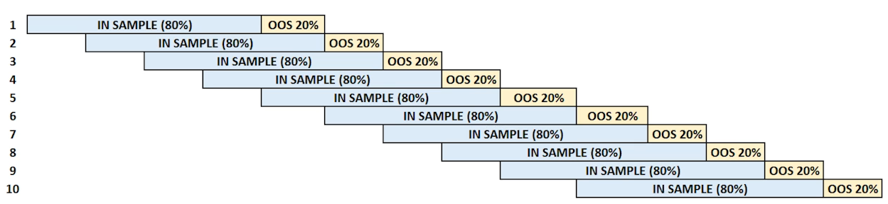

# Building Robust Strategies Process

1. Formulate
   * state trading rules
     * entry / exit
     * filters
     * risk management
     * profit management

2. Define
   * write pseudo-code
   * code multiple entries and exists as separate strategies

3. Confirm
   * write code
   * break up into testable pieces (unit test, visual inspection, etc)

4. Evaluate

   1. First Hurdle
      * Six two year historical periods
        * If slower moving strategy use four four year historical periods
      * futures: one from each sector
      * stocks: low/medium/high volatility stock from each sector
      * Identify family of strategies to evaluate. Examples
        * Three different trading paces: "Fast, Intermediate, and Slow" parameters
        * 2 yr and 4 yr periods
        * reversing and non-reversing (long/short)
        * Volatility filter (none, low, high)
      * continue if small losses to small/big wins for majority of periods and instruments
        * 
      * reject with no trades or mostly small losses
        * 
        * Can try adjusting stops, filters, speeds
   2. Second Hurdle
     * Same setup as first hurdle for historical periods and instruments
     * Do optimization for each instrument and period
     * 
     * significant majority should have tradeable profit and risk
     * performance should ideally exceed that of first hurdle
     * 
     * otherwise abort
     * 

5. The "Big Leap"

   1. Third Hurdle
      * split dataset into two parts
        * optimize on first data set then test results on 2nd
        
        * optimize on the 2nd data set then test results on the 1st
        
      * if majority pass (small loss or profit) proceed to Walk Forward Analysis
      * if extremely profitable highly likely strategy is very robust
        
      * if majority fail (small or large loss) abort
      * initially done with no filters or stops to show strategy is sound without additional support
        * If this fails can look at adding filters
   2. Optimization Profile
      * % of profitable simulations
        * Ideally 66%+ profitable
        * 25%+ marginal; further investigate internal structure
      * performance distribution
        * Ideally uniformly distributed through optimization space
        * parameters are evenly spaced
        * 
        * top parameter set is close to average performance of entire space (<1 stddev)
        * 
        * overall performance of entire simulation is profitable
        * 
      * shape of optimization space
        * uniformity, gentle hill, performance drops off gradually
        * 

6. Finalize

   1. Fourth Hurdle: Walk Forward Analysis (WFA)
      * In sample data used to optimize
      * Out of sample for evaluation (results concatenated together)
      * 
      * At least 3 WFAs: Usually perform on slow, intermediate, and fast
        * 5 or more if compute allows
        * 
      * All instruments from 1st phase
      * Full historical evaluation period
      * Walk Forward Matrix: 9 different WFAs
        * Walk Forward Speed {fast, medium, slow}
        * Parameter Ranges {fast, medium, slow}
        * Want to see all relatively smooth/similar results
        * Rule of thumb: 30 trades per variable; 60 - 100+ trades
        * Example non-reversing, no volatility filter, and fast parameter values:
        * 
        * 
      * Majority should exhibit tradable risk-adjusted returns
        * strategy is robust
        * risk-return profile is an accurate predictor of real-time performance
        * run remaining portfolio instrument candidates through WFA trio
        * Perform exhaustive search of various strategy instances or logic branches not yet explored. Eg filter config, adding stops, profit targets, combination of stops and targets
          * Strategy with and without entry filter 2
            * For each Reversal and Non-reversal 2
              * For each vol filter slow, med, fast 3
                * For each 3 different params 3
              * 3 risk stops
              * 3 target orders
          * => 2 X 2 X 3 X 3 X 3 X 3 = 324 test branches
      * If fail this hurdle abort
   2. Fifth Hurdle: Monte Carlo Analysis
      * If fail this hurdle abort

7. Implement

8. Monitor

9. Refine
    * re-optimize at the out-of-sample window period
